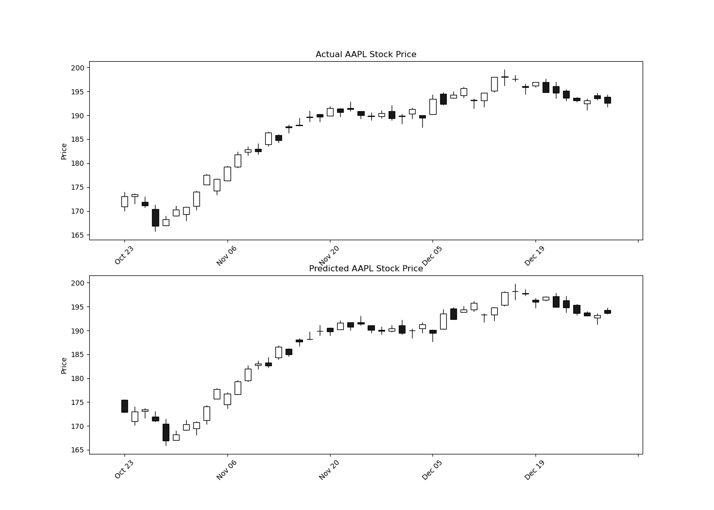

# Stock Prediction

🚀 A powerful project to predict stocks with AI.

## Getting Started

```bash
# Clone the repository
git clone https://github.com/when2buy/stock-prediction.git

# Install dependencies
pip install -r requirements.txt

# Run the project
python app/train.py
#[*********************100%%**********************]  1 of 1 completed
#Epoch 1/50, Loss: 0.1788
#Epoch 2/50, Loss: 0.0513
#Epoch 3/50, Loss: 0.0497
#Epoch 4/50, Loss: 0.0362
#Epoch 5/50, Loss: 0.0268
#Epoch 6/50, Loss: 0.0129
#Epoch 7/50, Loss: 0.0147
#Epoch 8/50, Loss: 0.0214
#Epoch 9/50, Loss: 0.0156
#...
```



## Features

- 📈 Predict stock prices with AI.
- 🤖 Built with Python and PyTorch.
- 📊 Visualize stock data with Matplotlib.
- 📦 Easy to use and deploy.
- 🚀 Fast and efficient.
- 🛠️ Customizable and extensible.

## License 

[](./LICENSE)
